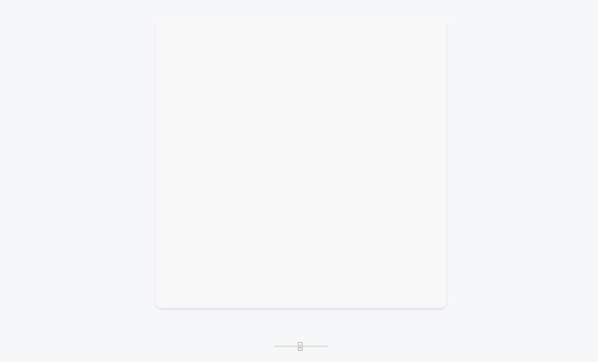
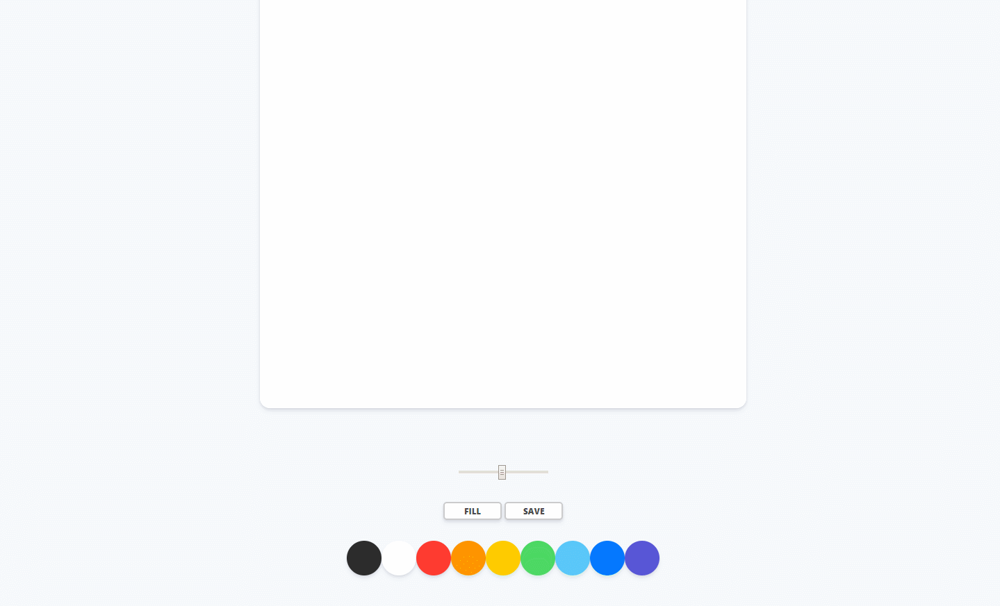

# 🎨 VanillaJS로 Painting Board 만들기

### 메인화면

선의 굵기를 조절할 수 있고, 9가지의 색을 선택할 수 있습니다.

### 선그리기

선의 굵기에 따라 선이 그려집니다.

### 채우기
;
'FILL' 버튼을 누르고 캔버스를 누르면 캔버스를 가득 채울 수 있습니다.

### 채우고 선그리기

'FILL' 상태에서 'PAINT' 버튼을 누르면 다시 선을 그릴 수 있습니다.

### 저장하기

'SAVE' 버튼을 누르면 현재까지 그린 그림을 저장할 수 있습니다.

## :sparkles: Built With

* [Vanilla JS](http://vanilla-js.com/)
* [Canvas2D](https://developer.mozilla.org/ko/docs/Web/API/CanvasRenderingContext2D)
* [Visual Studio Code](https://code.visualstudio.com/)

## :see_no_evil: Authors

* **heeseonim** - [heeseonim](https://github.com/heeseonim)

## :label: License

This project is licensed under the [Nomad Coders](https://academy.nomadcoders.co/)
